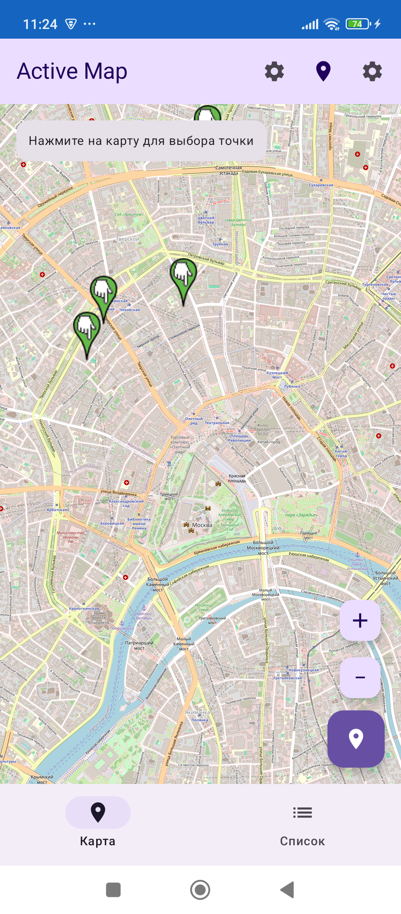
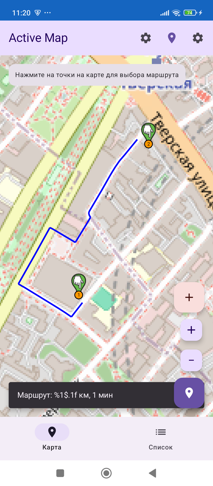

# ActiveMap

Kotlin Multiplatform + Compose Multiplatform application for tracking and cataloging locations. Supports Android, Desktop (JVM) and Web (Kotlin/JS).

## Screenshots

### Main map view


### Route building


## Stack

- **Kotlin 2.1.10** + **Compose Multiplatform 1.7.3**
- **Android**: OsmDroid (Maps), Room (Storage), Compose Material 3
- **Desktop**: Compose Desktop, Canvas (map rendering)
- **Web**: Kotlin/JS, HTML/CSS, Leaflet.js for maps
- **Common**: Koin (DI), kotlinx.coroutines, kotlinx.serialization, kotlinx.datetime, Ktor (HTTP)

## Structure

```
ActiveMap/
├── shared/             # Common module: models, ViewModel, Repository, shared UI, services
│   └── commonMain/
│       ├── model/      # Location, Route, enums
│       ├── repository/ # LocationRepository interface, InMemoryLocationRepository
│       ├── viewmodel/  # LocationViewModel (DI-ready)
│       ├── service/    # OsrmService, OfflineRouteService, LocationService, DataExporter
│       ├── ui/         # Shared Compose UI (SharedActiveMapApp, forms, lists)
│       ├── di/         # Koin app module
│       └── resources/  # Localization (RU/EN/DE/UK)
├── androidApp/         # Android: Room, OsmDroid, Koin Android module
├── desktopApp/         # Desktop: JSON file storage, Canvas map, Koin Desktop module
├── webApp/             # Web: localStorage, Leaflet.js, Koin Web module
├── .github/workflows/  # CI/CD (GitHub Actions)
├── build.gradle.kts
├── settings.gradle.kts
└── gradle.properties
```

## Launch

```bash
# Requires JDK 17+ (brew install openjdk@17)

# Android (emulator or device)
./gradlew :androidApp:installDebug

# Desktop
./gradlew :desktopApp:run

# Web (dev server)
./gradlew :webApp:jsBrowserDevelopmentRun

# Tests
./gradlew :shared:desktopTest :shared:testDebugUnitTest :shared:testReleaseUnitTest :shared:jsNodeTest
```

## Functionality

- **Map** with location markers (colors by activity type), long press to select a point
- **Geolocation** — center map on current position (Android with permission request, Web via browser API)
- **Routing** — build routes between two points via OSRM API (with offline straight-line fallback)
- **List of locations** with filtering by type/status and search by name
- **Adding a location** with full form and validation (name, coordinates, rating required)
- **Detailed card** with viewing and editing
- **Data persistence** — Room (Android), JSON file `~/.activemap/locations.json` (Desktop), localStorage (Web)
- **Export/Import** — JSON export and import of all locations
- **Localization** — Russian, English, German, Ukrainian
- **Error handling** — validation errors, operation feedback via Snackbar

## Architecture

- **shared** — common module with `@Serializable` models, `LocationViewModel` with DI, `LocationRepository` interface, shared Compose UI (`SharedActiveMapApp`, forms, lists), services (`OsrmService`, `OfflineRouteService`, `LocationService`, `DataExporter`). Platform-specific implementations in `androidMain`, `desktopMain`, `jsMain`.
- **DI** — Koin with platform-specific modules providing `LocationRepository` and `LocationService`
- **AndroidApp** — Room database, OsmDroid maps, location permissions, Koin Android module
- **DesktopApp** — JSON file storage, Canvas-based map, Koin Desktop module
- **WebApp** — localStorage, Leaflet.js maps, Koin Web module
- **CI/CD** — GitHub Actions: build Android + Desktop, run all tests (JVM, Android, JS Node)

## Data model

| Field | Types |
|------|------|
| Name | line (required) |
| Type of activity | SPORT, WORK, REST, EDUCATION, ENTERTAINMENT |
| Coordinates | latitude (-90..90), longitude (-180..180) (required) |
| Coverage | NONE, PARTIAL, MEDIUM, FULL |
| Lighting | NONE, LOW, MEDIUM, BRIGHT |
| Cleanliness | DIRTY, POOR, MEDIUM, CLEAN, PERFECT |
| Noise | QUIET, LOW, MEDIUM, LOUD, VERY_LOUD |
| Inventory | line |
| Rating | 1-5 (required) |
| Status | WAS_THERE, WANT_TO_VISIT, NOT_SUITABLE |
| Notes | line |
| Photos | list of links |
| Created/Updated | timestamps |

## Requirements

- JDK 17+
- Android SDK (API 34+)
- Gradle 9.6.1 (wrapper in the project)
- Node.js (for JS tests)

## License

MIT